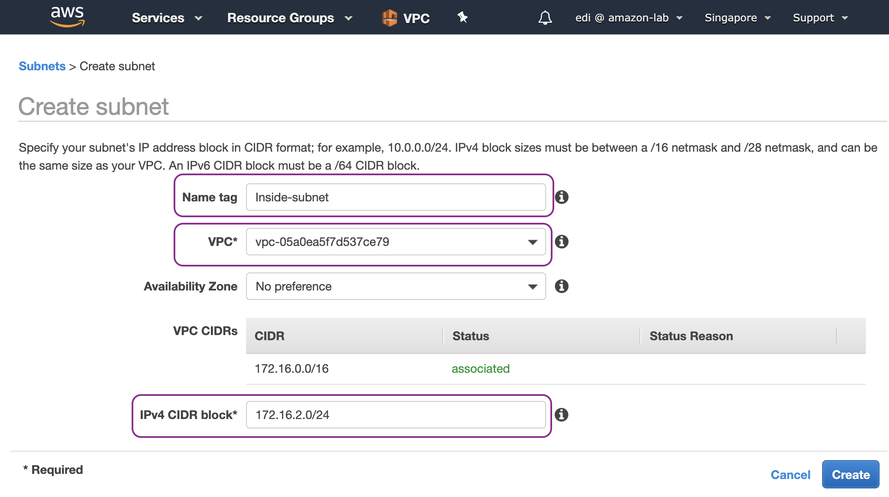
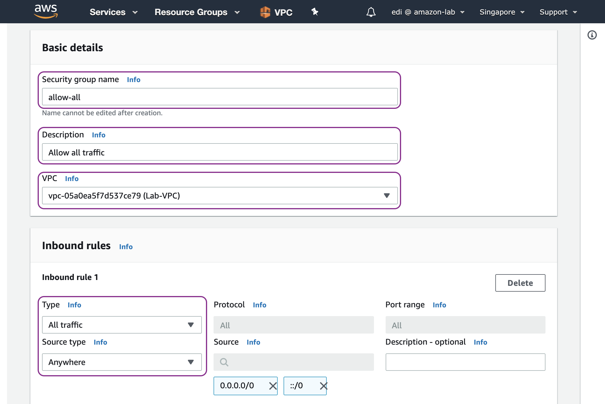
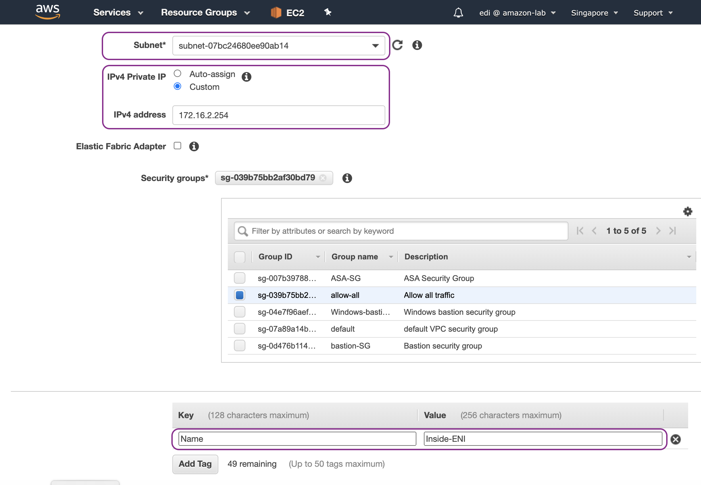
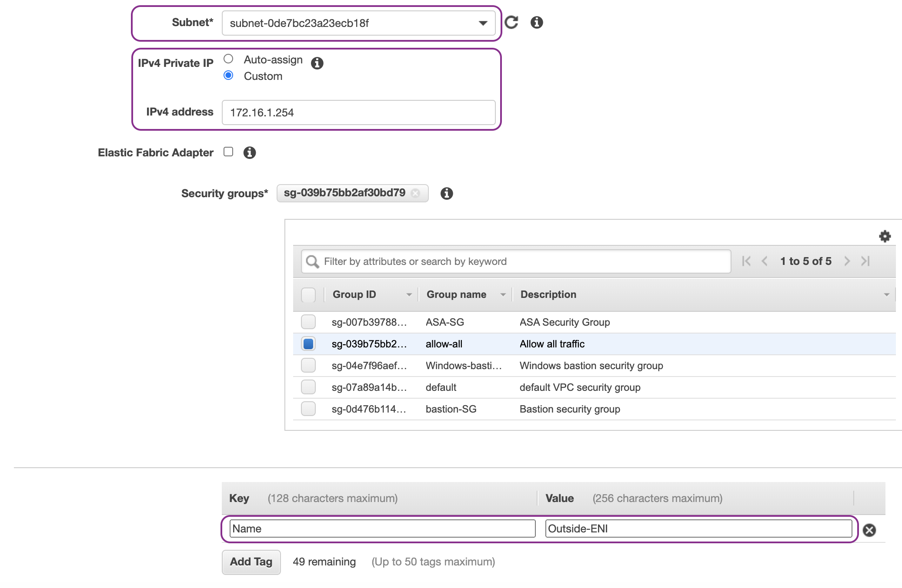
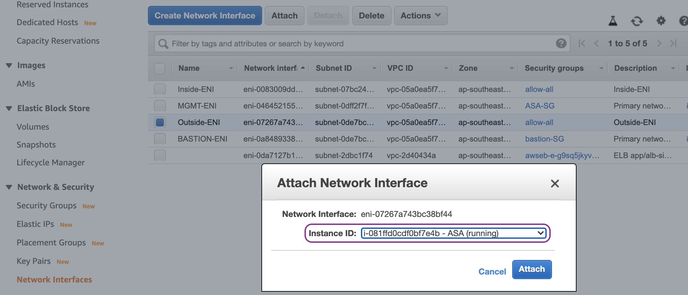
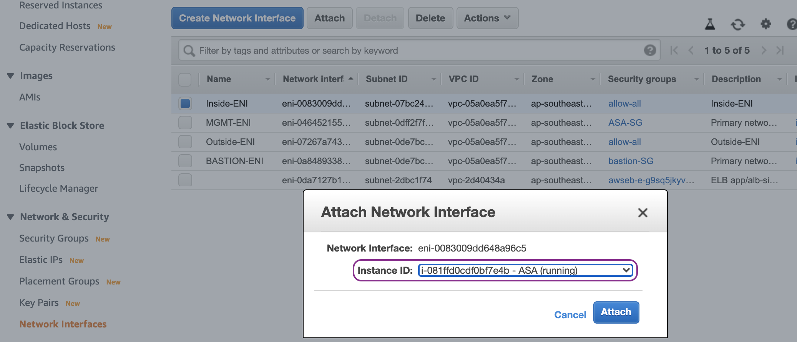
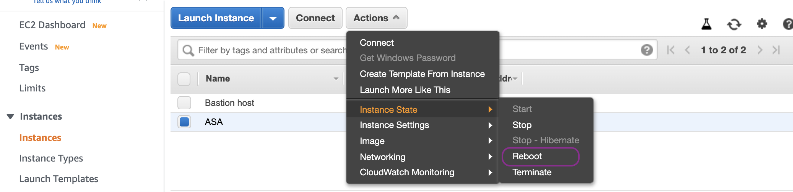
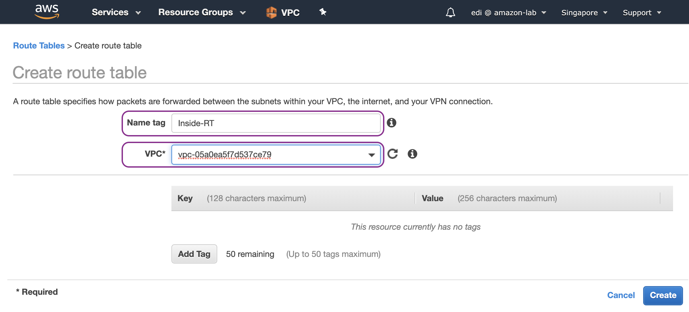
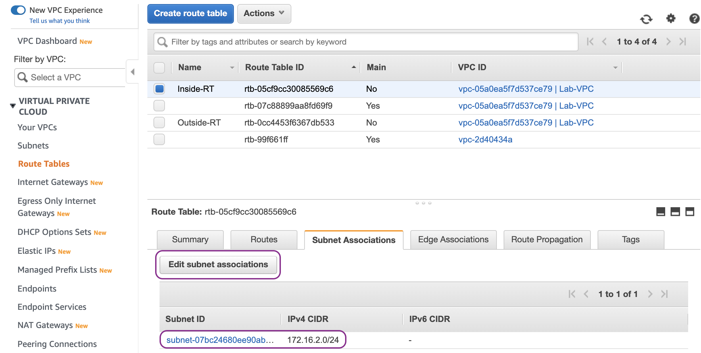
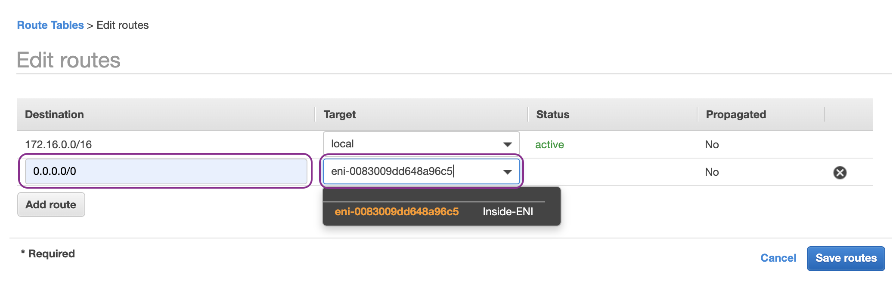

Configure the data plane of ASAv
================================

In this chapter, we will be deploying the data plane of ASA by configuring Outside, and Inside subnets:

.. image:: ASAv-inside-outside.png
   :width: 600px
   :alt: ASAv Inside Outside

Let us start by deploying components on AWS first:

#. Create a private subnet for Inside network and assign subnet 172.16.2.0/24.
#. Create a security group named allow-all that allows all traffic because we want to control the access via ASAv.
#. Create Outside and Inside ENIs (elastic network interfaces) of ASAv with security group allow-all. Attach those ENIs to the ASAv.
#. Create a route table, associate it with Inside subnet and add a default route entry for any destination (0.0.0.0/0) with the target of Inside ENI of ASAv.

On AWS Management Console, go to the VPC dashboard and start by creating a private subnet for Inside network 172.16.2.0/24:

Create a security group (SG) named allow-all with an inbound rule that allows all traffic from anywhere:

Go to EC2 dashboard, create Inside ENI, choose Inside-subnet (172.16.2.0/24) and assign IP address 172.16.2.254:

Create Outside ENI, choose Outside subnet (172.16.1.0/24) and assign IP address 172.16.1.254:

Attach Outside and Inside ENIs to the ASAv instance.  Ouside-ENI first:

And then followed by Inside-ENI:

Reboot the ASAv instance so that the new network interfaces are recogise by ASAv operating system:

Go back to VPC dash board. Then create Inside route table, associate it with Inside subnet and add a default route entry for any destination (0.0.0.0/0) with the target of Inside ENI of ASAv:

Now we are ready to configure the ASAv:

#. Assign IP address 172.16.1.254/24 to outside network interface.
#. Assign IP address 172.16.2.254/24 to inside network interface.
#. Create a default route entry or any destination (0.0.0.0/0) with the target of Local router (172.16.1.1) via outside interface.
#. Add icmp to the inspection policy map which is applied in the global scope.
#. Create a NAT rule (hide NAT) to translate the source IP address of inside network.

