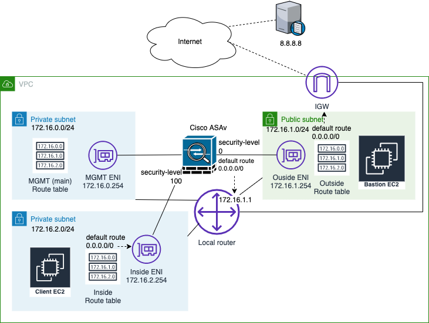

Configure the data plane of ASAv
================================

In this chapter, we will be deploying the data plane of ASA by configuring Outside, Inside and DMZ interfaces.

Let us start by deploying Outside and Inside configuration first:

