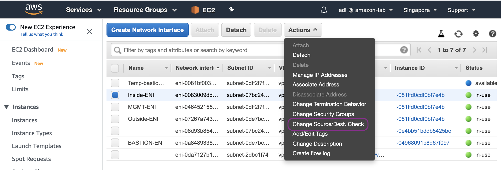
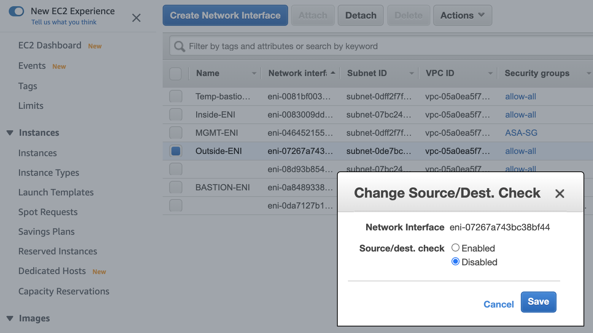
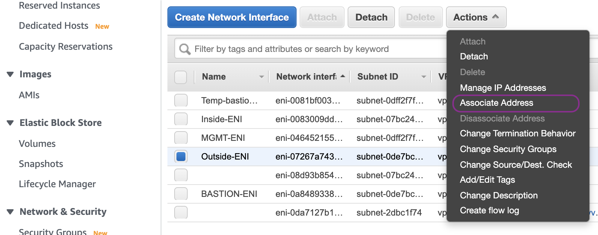
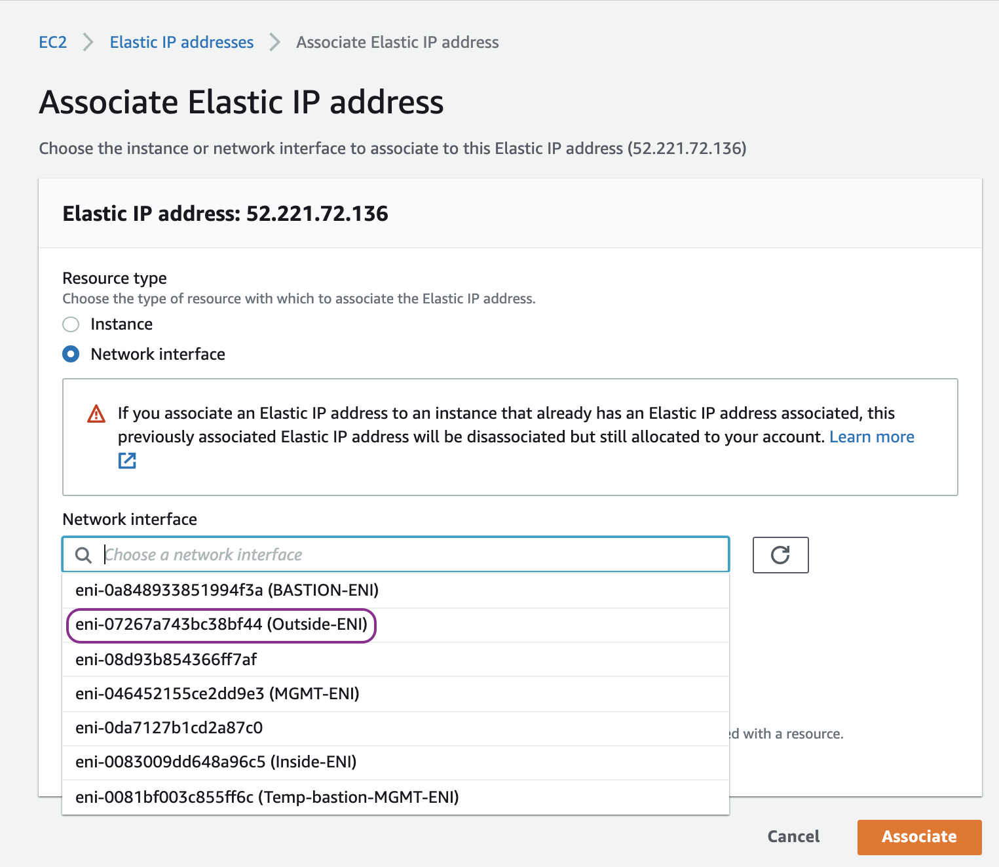

Configure the data plane of ASAv
================================

In this chapter, we will be deploying the data plane of ASA by configuring Outside, and Inside subnets:

.. image:: ASAv-inside-outside.png
   :width: 600px
   :alt: ASAv Inside Outside

AWS Components
--------------
Let us start by deploying components on AWS first:

#. Create a private subnet for Inside network and assign subnet 172.16.2.0/24.
#. Create a security group named allow-all that allows all traffic because we want to control the access via ASAv.
#. Create Outside and Inside ENIs (elastic network interfaces) of ASAv with security group allow-all. Attach those ENIs to the ASAv.
#. Create a route table, associate it with Inside subnet and add a default route entry for any destination (0.0.0.0/0) with the target of Inside ENI of ASAv.

On AWS Management Console, go to the VPC dashboard and start by creating a private subnet for Inside network 172.16.2.0/24:

Create a security group (SG) named allow-all with an inbound rule that allows all traffic from anywhere:

Go to EC2 dashboard, create Inside ENI, choose Inside-subnet (172.16.2.0/24) and assign IP address 172.16.2.254:

Create Outside ENI, choose Outside subnet (172.16.1.0/24) and assign IP address 172.16.1.254:

Attach Outside and Inside ENIs to the ASAv instance.  Ouside-ENI first:

And then followed by Inside-ENI:

Disable source destination check on both Inside and Outside ENIs:

.. image:: Inside-change-src-dst-check.png
   :width: 600px
   :alt: Change Inside source destination check

Associate an Elastic IP (public IPv4) to Outside ENI:

Reboot the ASAv instance so that the new network interfaces are recogise by ASAv operating system:

Go back to VPC dash board. Then create Inside route table, associate it with Inside subnet and add a default route entry for any destination (0.0.0.0/0) with the target of Inside ENI of ASAv:

.. image:: Inside-RT-default-route.png
   :width: 600px
   :alt: Default route in Inside route table

ASAv Configuration
------------------
Now we are ready to configure the ASAv.

Create a route entry for destination of outside network where Bastion host resides with the target of Local router (172.16.0.1) via management interface:

.. code-block:: console

   route management 172.16.0.0 255.255.0.0 172.16.0.1

**NOTE**
The route is installed in the management VRF (virtual routing and forwarding) of the ASA. Therefore, to check the route, please use `show route management` instead of `show route` which is showing the default VRF. 

Assign a static IP address of 172.16.0.254/24 to management network if the Day 0 Confguration that we entered in the User Data of ASAv EC2 is not set:

.. code-block:: console

   interface management0/0
   management-only
   nameif management
   security-level 100
   ip address 172.16.0.254 255.255.255.0
   no shut

**NOTE**
Your management SSH session might be disconnected. If so, please login back in.

Assign IP address 172.16.1.254/24 to outside network interface:

.. code-block:: console

   interface TenGigabitEthernet0/0
   nameif outside
   security-level 0
   ip address 172.16.1.254 255.255.255.0
   no shut

Assign IP address 172.16.2.254/24 to inside network interface:

.. code-block:: console

   interface TenGigabitEthernet0/1
   nameif inside
   security-level 100
   ip address 172.16.2.254 255.255.255.0
   no shut

Create a default route entry or any destination (0.0.0.0/0) with the target of Local router (172.16.1.1) via outside interface:

.. code-block:: console

   route outside 0.0.0.0 0.0.0.0 172.16.1.1

Add icmp to the inspection policy map which is applied in the global scope:

.. code-block:: console

   policy-map global_policy
   class inspection_default
   inspect icmp
   inspect icmp error

**NOTE**
policy-map global_policy is applied in the global scope: `service-policy global_policy global`

Create a NAT rule (hide NAT) to translate the source IP address of inside network:

.. code-block:: console

   nat (inside,outside) after-auto source dynamic any interface

Launch an EC2 instance as a client host with IP address 172.16.2.100 in the Inside subnet:

