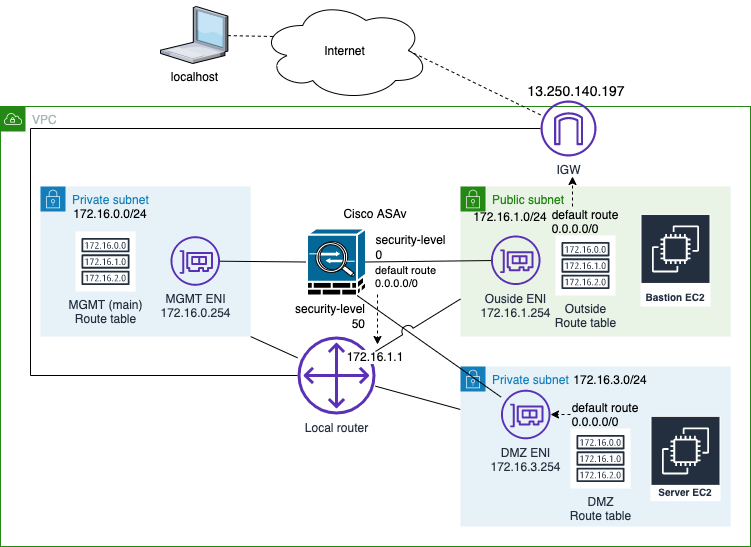
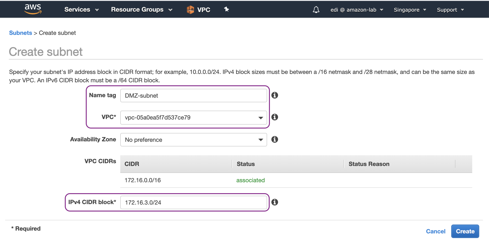
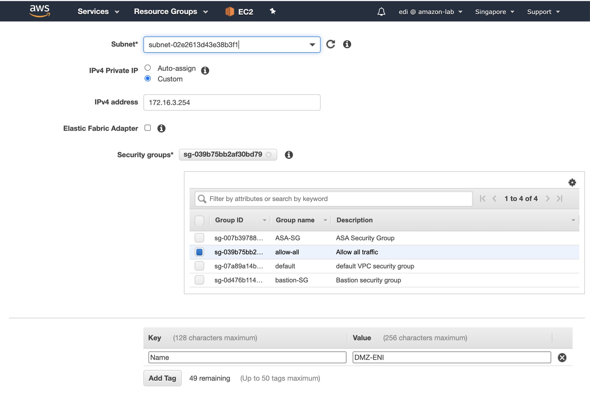
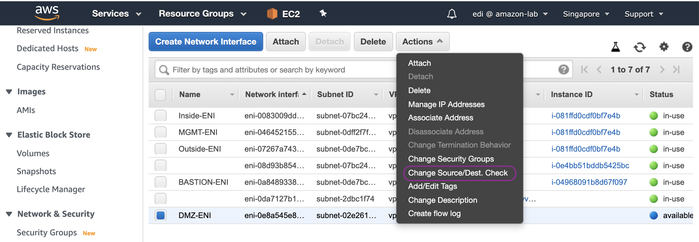
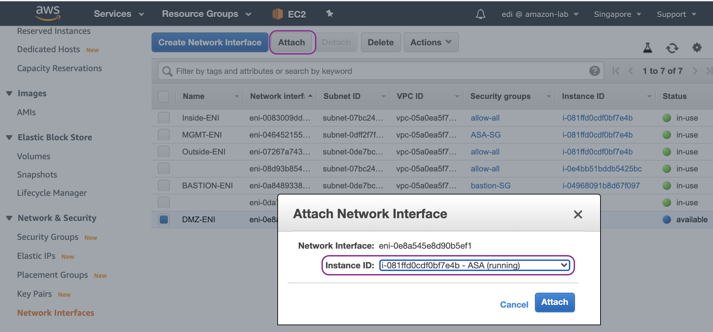
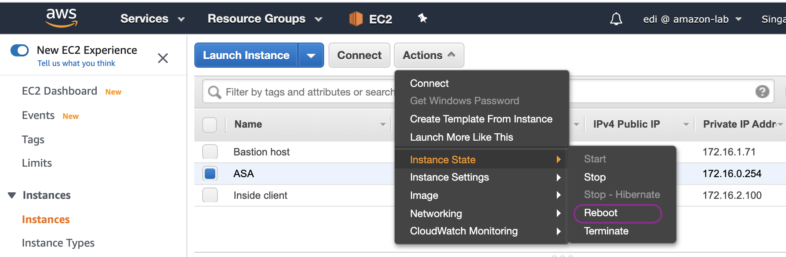
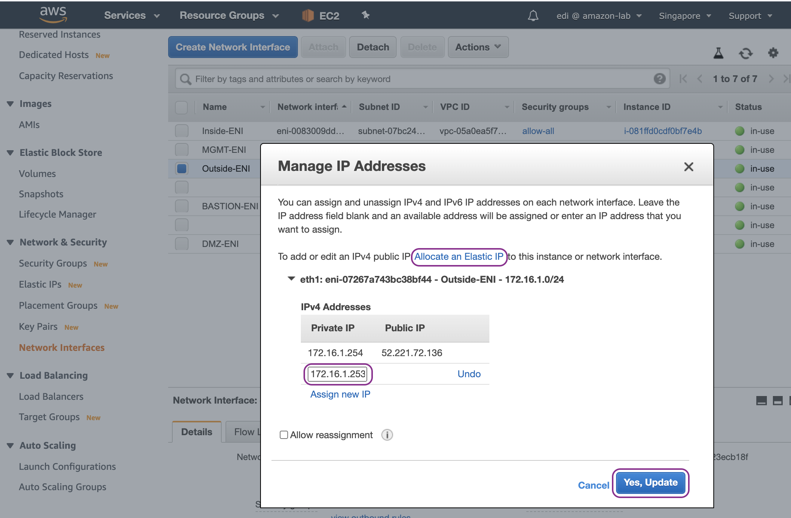
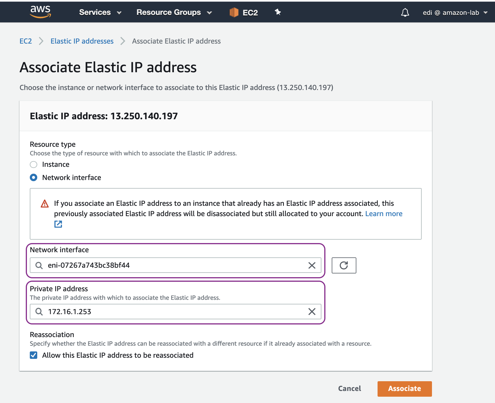
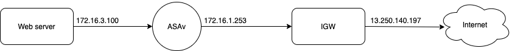

DMZ subnet behind the ASAv
==========================

In this chapter, we add the DMZ subnet to place a web server that can be accessed from the Internet:

Let's start by creating AWS components:

#. Create DMZ subnet.
#. Create DMZ ENI with security group allow-all.
#. Create a route table, associate it with DMZ subnet and add a default route entry for any destination (0.0.0.0/0) with the target of DMZ ENI of ASAv.
#. Disable source destination check of DMZ ENI.
#. Attach DMZ ENI to the ASAv instance.
#. Reboot the ASAv instance so that DMZ ENI is recognised by ASAv operating system.
#. Assign a secondary IPv4 address to Outside ENI and associate a second EIP.

Create DMZ subnet:

Create DMZ ENI with security group allow-all:

Disable source destination check of DMZ ENI:

Attach DMZ ENI to the ASAv instance:

Reboot the ASAv instance so that DMZ ENI is recognised by ASAv operating system:

Assign a secondary IPv4 address to Outside ENI and associate a second EIP:

On ASAv, first we configure the IP address of dmz interface:

.. code-block:: console

    interface TenGigabitEthernet0/2
    nameif dmz
    security-level 50
    ip address 172.16.3.254 255.255.255.0
    no shut

We create the following network objects and auto-NAT rule:

.. code-block:: console

    object network ubuntu-server-dmz
        host 172.16.3.100
    object network ubuntu-server-outside
        host 172.16.1.253

    object network ubuntu-server-dmz
        nat (dmz,outside) static ubuntu-server-outside service tcp www www 

Then we create access-list entry and apply it to ingress traffic of outside interface:

.. code-block:: console

   access-list outside_access_in extended permit tcp any4 any4 eq www log disable 
   access-group outside_access_in in interface outside

If we want to allow hosts in DMZ subnet to access Internet, we can add this NAT (hide-NAT) rule:

.. code-block:: console

    nat (dmz,outside) after-auto source dynamic any interface

Lastly, launch an EC2 instance as a web server in DMZ subnet with private IP 172.16.3.100 and access it via its public IP http://13.250.140.197

**NOTE**
Double-NAT has happened. That is, IP address 172.16.1.253 (outside static NAT of ASAv) is translated by AWS IGW to 13.250.140.197 (Elastic IP).

References
----------
* DMZ Configuration Example https://www.speaknetworks.com/cisco-asa-dmz-configuration-example/ 