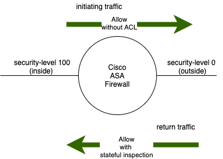
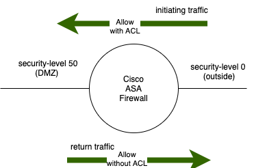
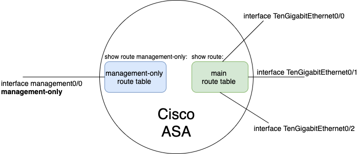
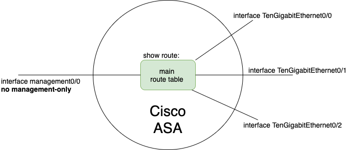

ASA Fundamentals
================

Security Level
--------------

From a higher security level to a lower security level:

* No ACL is required for traffic to traverse from a higher security level to a lower security level.
* The stateful inspection determines whether the return traffic is allowed to make it back through.

From a lower security level to a higher security level:

* ACL is required for initiating traffic to traverse from a lower security level to a higher security level.
The ACL is usually applied (using access-group CLI) ingress on the interface with the lower security level (e.g. outside interface);
although it can also be applied egress on the interface with the higher security level (e.g. dmz interface).
* No ACL is required for the return traffic from a higher security level to a lower security level.

Route Tables
------------

The management interface can be associated with its own management-only route table:

Alternatively, the management interface can be associated with the main route table:

