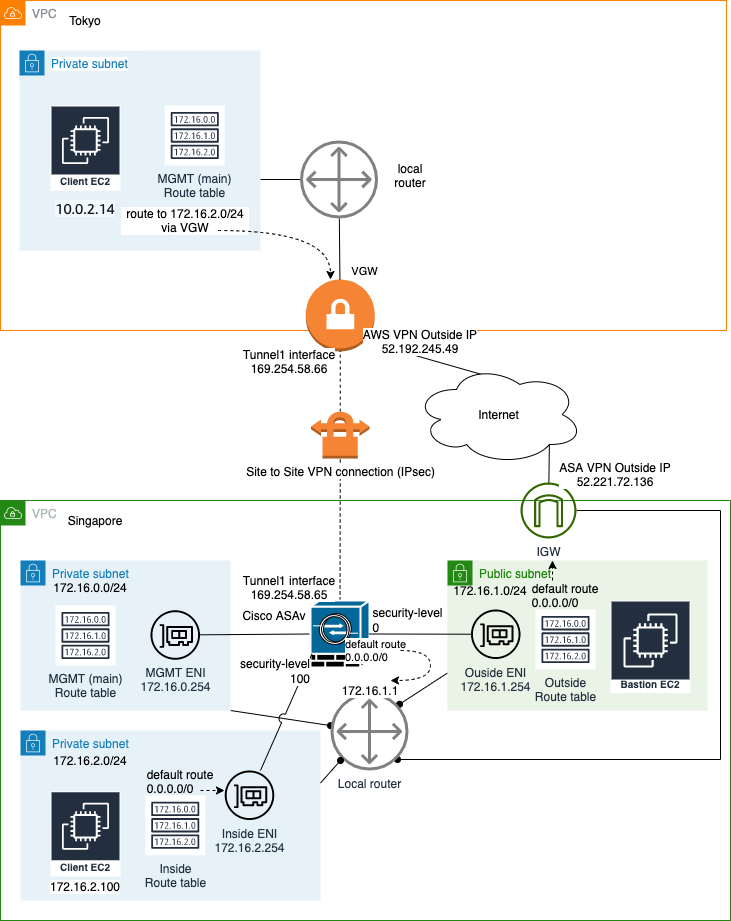

Site to Site VPN 
================

In this chapter, we will configure a IPsec tunnel between ASAv and AWS Managed VPN: 

ASAv configuration:
.. code-block:: console

    ! --------------------------------------------------------------------------------
    ! IPSec Tunnel #1
    ! --------------------------------------------------------------------------------
    ! #1: Internet Key Exchange (IKE) Configuration

    crypto ikev1 enable outside 

    crypto ikev1 policy 200
    encryption aes 
    authentication pre-share
    group 2
    lifetime 28800
    hash sha

    ! --------------------------------------------------------------------------------		
    ! #2: IPSec Configuration

    crypto ipsec ikev1 transform-set ipsec-prop-vpn-04a0ce01a40f54075-0 esp-aes  esp-sha-hmac

    ! The IPSec profile references the IPSec transform set and further defines
    ! the Diffie-Hellman group and security association lifetime.
    crypto ipsec profile ipsec-vpn-04a0ce01a40f54075-0
    set pfs group2
    set security-association lifetime seconds 3600
    set ikev1 transform-set ipsec-prop-vpn-04a0ce01a40f54075-0
    exit

    ! This option instructs the router to clear the "Don't Fragment"
    ! bit from packets that carry this bit and yet must be fragmented, enabling
    ! them to be fragmented. 
    crypto ipsec df-bit clear-df outside

    ! This option causes the firewall to reduce the Maximum Segment Size of
    ! TCP packets to prevent packet fragmentation.
    sysopt connection tcpmss 1379

    ! This configures the gateway's window for accepting out of order
    ! IPSec packets. A larger window can be helpful if too many packets
    ! are dropped due to reordering while in transit between gateways.
    crypto ipsec security-association replay window-size 128

    ! This option instructs the router to fragment the unencrypted packets
    ! (prior to encryption).
    crypto ipsec fragmentation before-encryption outside

    ! The tunnel group sets the Pre Shared Key used to authenticate the 
    ! tunnel endpoints.
    tunnel-group 13.54.44.222 type ipsec-l2l
    tunnel-group 13.54.44.222 ipsec-attributes
    ikev1 pre-shared-key zy6vsjotOz9JD_I.OvFq7Jc1tplv8O_f

    ! This option enables IPSec Dead Peer Detection, which causes semi-periodic
    ! messages to be sent to ensure a Security Association remains operational.

    isakmp keepalive threshold 10 retry 10
    exit

    ! --------------------------------------------------------------------------------
    ! #3: Tunnel Interface Configuration

    ! Association with the IPSec security association is done through the
    ! "tunnel protection" command.
    interface Tunnel1
    nameif Tunnel-int-vpn-04a0ce01a40f54075-0		
    ip address 169.254.179.162 255.255.255.252
    tunnel source interface outside
    tunnel destination 13.54.44.222
    tunnel mode ipsec ipv4
    tunnel protection ipsec profile ipsec-vpn-04a0ce01a40f54075-0
    no shutdown
    exit

    ! --------------------------------------------------------------------------------
    ! #4: Border Gateway Protocol (BGP) Configuration

    router bgp 64513
    address-family ipv4 unicast
        neighbor 169.254.179.161 remote-as 64512
        neighbor 169.254.179.161 timers 10 30 30
        neighbor 169.254.179.161 default-originate
        neighbor 169.254.179.161 activate
        
    ! To advertise additional prefixes to Amazon VPC, copy the 'network' statement
    ! and identify the prefix you wish to advertise. Make sure the prefix is present
    ! in the routing table of the device with a valid next-hop.
    ! network 0.0.0.0 
        network 172.16.2.0 mask 255.255.255.0
        no auto-summary
        no synchronization
    exit-address-family
    exit