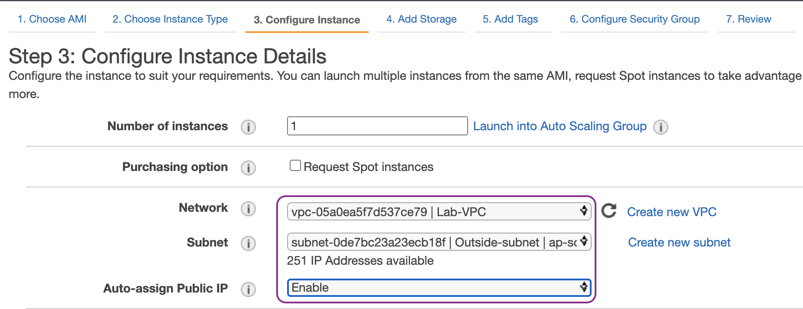
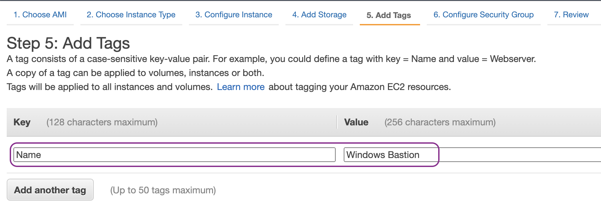

Deploy the ASAv On the AWS Cloud
================================

In this chapter, we will be discussing about how to deploy Cisco ASAv (virtual Adaptive Security Appliance) on AWS (Amazon Web Services). 

Initial topology:

* The primary elastic network interface (MGMT ENI) is mapped to the management interface (Management0/0).
* Windows bastion host is deployed in a public subnet to be used for accessing the ASA management interface which is deployed in a private subnet via Local router.
* Route entry to any IPv4 destination (0.0.0.0/0) with IGW (Internet Gateway) as a target is added into Outside route table to provide Internet access to the Windows bastion host.

.. image:: ASA-initial-topology.png
   :width: 600px
   :alt: ASA initial topology

Let's start building the initial topology by creating the VPC with CIDR 172.16.0.0/16:

.. image:: VPC.png
   :width: 600px
   :alt: VPC

Then we create two subnets: MGMT (management) subnet in a private subnet (172.16.0.0/24) and Outside subnet in a public subnet (172.16.1.0/24):

.. image:: mgmt-outside-subnets.png
   :width: 600px
   :alt: Management and Outside subnets

Create a IGW and attach it to the VPC. The IGW will be used as the default route target (next-hop) of the public subnet.

.. image:: IGW.png
   :width: 600px
   :alt: IGW

Create Ouside route table and a route entry with the destination any (0.0.0.0/0) and the target of the IGW as the next hop:

.. image:: outside-RT.png
   :width: 600px
   :alt: Outside Route table

Associate the Outside route table to the Outside subnet:

.. image:: outside-RT-subnet-assoc.png
   :width: 600px
   :alt: Associate Outside Route table with Outside subnet

Launch an EC2 instance named Windows Bastion and enable Auto-assign Public IP so that the EC2 instance can be accessed from Internet:

Sample Day 0 Configuration

.. code-block:: console

   ! required config start   
   ! ASA Version 9.14(1)10
   interface management0/0
   management-only
   nameif management
   security-level 100
   ip address 172.16.0.254 255.255.255.0 
   no shut
   !
   same-security-traffic permit inter-interface
   same-security-traffic permit intra-interface
   !
   crypto key generate rsa modulus 2048
   ssh 0 0 management
   ssh timeout 30
   username admin nopassword privilege 15
   username admin attributes
   service-type admin
   ! required config end
   ! example dns configuration
   dns domain-lookup management
   DNS server-group DefaultDNS
   ! where this address is the .2 on your VPC CIDR
   name-server 172.16.0.2
   ! example ntp configuration
   name 129.6.15.28 time-a.nist.gov
   name 129.6.15.29 time-b.nist.gov
   name 129.6.15.30 time-c.nist.gov
   ntp server time-c.nist.gov
   ntp server time-b.nist.gov
   ntp server time-a.nist.gov
   ! required config end 

Here is the topology of ASA on AWS VPC (virtual private cloud)

.. image:: ASA.png
   :width: 600px
   :alt: ASA

Several types of workload servers are placed in each subnet:

* Windows Bastion as a jump box 
* Ubuntu MGMT as a TFTP server 
* Ubuntu Client in inside (protected zone)
* Ubuntu Server in DMZ (de-militarised zone)

.. image:: ASA-Workload.png
   :width: 600px
   :alt: ASA
