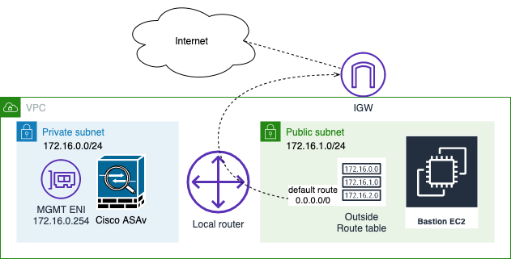
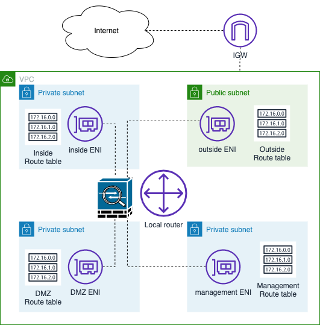
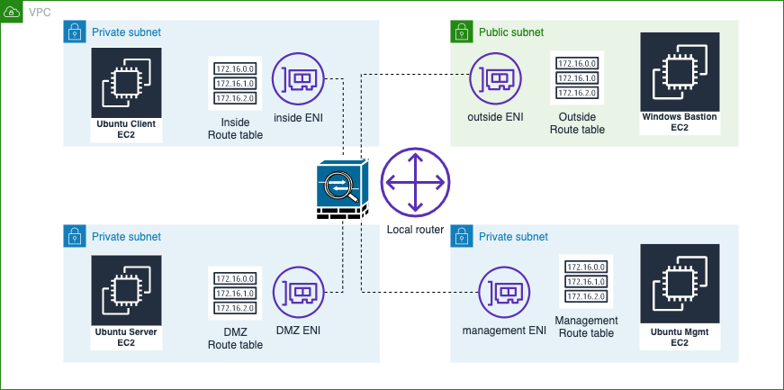

Deploy the ASAv On the AWS Cloud
================================

In this chapter, we will be discussing about how to deploy Cisco ASAv (virtual Adaptive Security Appliance) on AWS (Amazon Web Services). 

In the initial topology:

* The primary elastic network interface (MGMT ENI) is mapped to the management interface (Management0/0).
* Windows bastion host is deployed in a public subnet to be used for accessing the ASA management interface which is deployed in a private subnet via Local router.
* Route entry to any IPv4 destination (0.0.0.0/0) with IGW (Internet Gateway) as a target is added into Outside route table to provide Internet access to the Windows bastion host.

Sample Day 0 Configuration

.. code-block:: console

   ! ASA Version 9.4.1.200
   interface management0/0
   management-only
   nameif management
   security-level 100
   ip address dhcp setroute
   no shut
   !
   same-security-traffic permit inter-interface
   same-security-traffic permit intra-interface
   !
   crypto key generate rsa modulus 2048
   ssh 0 0 management
   ssh timeout 30
   username admin nopassword privilege 15
   username admin attributes
   service-type admin
   ! required config end
   ! example dns configuration
   dns domain-lookup management
   DNS server-group DefaultDNS
   ! where this address is the .2 on your public subnet
   name-server 172.19.0.2
   ! example ntp configuration
   name 129.6.15.28 time-a.nist.gov
   name 129.6.15.29 time-b.nist.gov
   name 129.6.15.30 time-c.nist.gov
   ntp server time-c.nist.gov
   ntp server time-b.nist.gov
   ntp server time-a.nist.gov

Here is the topology of ASA on AWS VPC (virtual private cloud)

Several types of workload servers are placed in each subnet:

* Windows Bastion as a jump box 
* Ubuntu MGMT as a TFTP server 
* Ubuntu Client in inside (protected zone)
* Ubuntu Server in DMZ (de-militarised zone)

