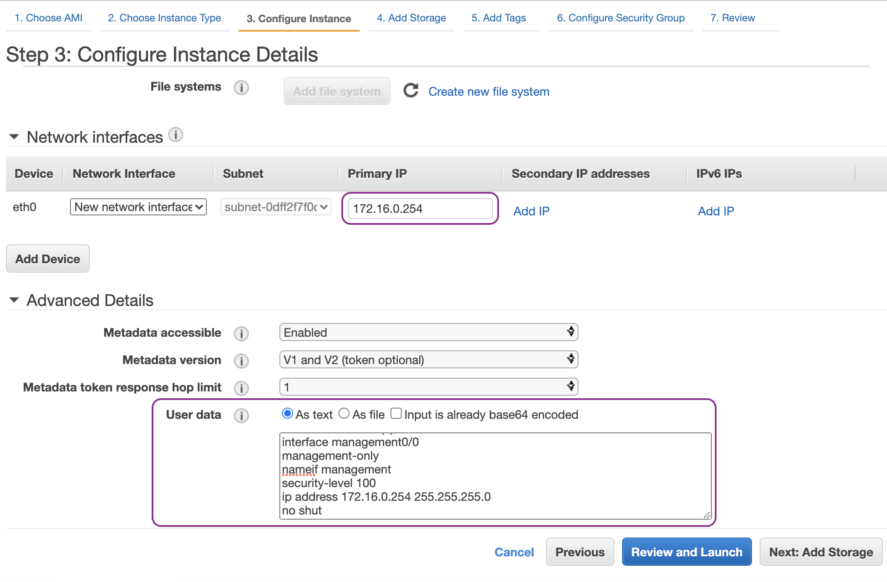

Deploy the ASAv On the AWS Cloud
================================

In this chapter, we will be discussing about how to deploy Cisco ASAv (virtual Adaptive Security Appliance) on AWS (Amazon Web Services). 

Initial topology:

* The primary elastic network interface (MGMT ENI) is mapped to the management interface (Management0/0).
* Windows bastion host is deployed in a public subnet to be used for accessing the ASA management interface which is deployed in a private subnet via Local router.
* Route entry to any IPv4 destination (0.0.0.0/0) with IGW (Internet Gateway) as a target is added into Outside route table to provide Internet access to the Windows bastion host.

Let's start building the initial topology by creating the VPC with CIDR 172.16.0.0/16:

Then we create two subnets: MGMT (management) subnet in a private subnet (172.16.0.0/24) and Outside subnet in a public subnet (172.16.1.0/24):

.. image:: mgmt-outside-subnets.png
   :width: 600px
   :alt: Management and Outside subnets

Create a IGW and attach it to the VPC. The IGW will be used as the default route target (next-hop) of the public subnet:

.. image:: IGW.png
   :width: 600px
   :alt: IGW

Create Ouside route table and a route entry with the destination any (0.0.0.0/0) and the target of the IGW as the next hop:

Associate the Outside route table to the Outside subnet:

.. image:: outside-RT-subnet-assoc.png
   :width: 600px
   :alt: Associate Outside Route table with Outside subnet

Launch an EC2 instance as a bastion host and enable Auto-assign Public IP so that the EC2 instance can be accessed from Internet. The bastion host will be used as a jump box to allow access to the management interface of the ASA:

Now we are ready to deploy Cisco ASAv. Let us launch an ASAv EC2 instance from AWS Marketplace:

The AWS c5 instances offer much higher performance than the older c3, c4, and m4 instances. We should choose xlarge size if we want to have 1 management plus 3 data plane interfaces (outside, inside and DMZ):

We place the primary network interface of the ASAv in the management subnet and also enter the Day 0 Configuration:

Sample Day 0 Configuration

.. code-block:: console

   ! required config start   
   ! ASA Version 9.14(1)10
   interface management0/0
   management-only
   nameif management
   security-level 100
   ip address 172.16.0.254 255.255.255.0 
   no shut
   !
   same-security-traffic permit inter-interface
   same-security-traffic permit intra-interface
   !
   crypto key generate rsa modulus 2048
   ssh 0 0 management
   ssh timeout 30
   username admin nopassword privilege 15
   username admin attributes
   service-type admin
   ! required config end
   ! example dns configuration
   dns domain-lookup management
   DNS server-group DefaultDNS
   ! where this address is the .2 on your VPC CIDR
   name-server 172.16.0.2
   ! example ntp configuration
   name 129.6.15.28 time-a.nist.gov
   name 129.6.15.29 time-b.nist.gov
   name 129.6.15.30 time-c.nist.gov
   ntp server time-c.nist.gov
   ntp server time-b.nist.gov
   ntp server time-a.nist.gov
   ! required config end 

We assign a name tag to the ASAv:

To tighten the security, we configure the security group of the management interface of the ASA to allow only traffic sourced from Bastion host:

Then launch the ASAv instance:

At this stage, we should have two EC2 instances:

.. image:: ASAv-IP.png
   :width: 600px
   :alt: Initial EC2 instances

We want to be able to login  from localhost (my laptop) to the ASAv via the Bastion host. In order to do so, we need to setup SSH forwarding agent:

.. image:: ASAv-SSH-forwarding-path.png
   :width: 600px
   :alt: SSH forwarding path

Let us cache ap-southeast-1.pem which is the private key to authenticate to the Bastion host:

.. code-block:: console

   localhost aws-lab$ ls -l ap-southeast-1.pem
   -r--------@ 1 ewi  ANT\Domain Users  1692 30 Aug 05:37 ap-southeast-1.pem

   localhost aws-lab$ ssh-add -D
   All identities removed.

   localhost aws-lab$ ssh-add ap-southeast-1.pem
   Identity added: ap-southeast-1.pem (ap-southeast-1.pem)

   localhost aws-lab$ ssh-add -L
   ssh-rsa <redacted - public key of ap-southeast-1.pem key pair>

Once the SSH key is cached, we can login direct to the ASAv via the Bastion host:

.. code-block:: console

   localhost aws-lab$ ssh -A ubuntu@18.141.25.204 ssh admin@172.16.0.254

Up to this point, we have provisioned the management plane of ASA. We will continue to provide the data plane by deploying Inside, Outside and DMZ interfaces on the ASA.
